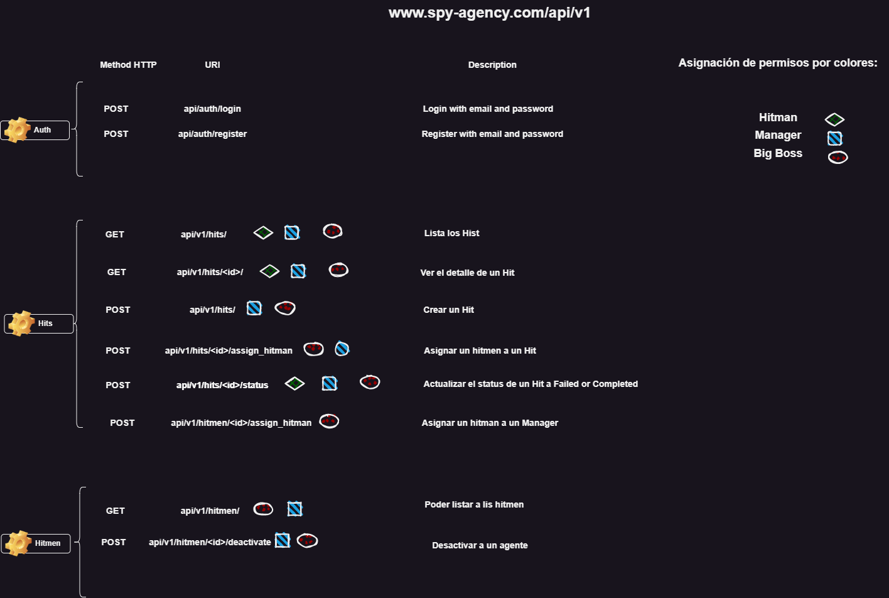

<h1 align="center" id="title"> 🕵️‍♂️ API tool for manage the hits of a international spy agency </h1>

## Table of Contents
- [Table of Contents](#table-of-contents)
- [💡Features](#features)
  - [Extra Features](#extra-features)
- [🚀 System Design](#api-design)
  - [🏠 Local enviroment](#-local-enviroment)
- [🧑‍💻 Installation Steps](#-installation-steps)
  - [🔓 How to test the API using Token Authorization](#-how-to-test-the-api-using-token-authorization)
  - [🚀 Demo](#-demo)
- [Licence](#licence)
- [👨‍💻Author](#author)

## 💡Features
Here are some of the project's best features:
- Hitmen 🕵️
  - List Hitmen ✅
  - Deactivate Hitman if the hitman is retired or die in a mission ✅

- Users 🧑‍💼👩‍💼
  - Register user into the platform ✅
  - Login user into the system using JWT to provide a token to users ✅

- Hits 🎯
  - List hits ✅
  - Hit detail ✅
  - Create a Hit ✅
  - Assign a Hitman toa Hit ✅
  - Update Hit status - options(failed, completed) ✅
  - Assign a hitman to a Manager ✅

### Extra Features
- Use of container technology (Docker) to package code ✅
- Override of the user to create instances of Hitman an Manager ✅
- Implement JWT for manage authentication ✅
- Implement Swagger documentation ✅

## 🚀 API Design
In order to develop the API, I separated responsibilities for each one of them by authentication, hits and hitmen, which were the main entities.

In addition to this, I added an illustrative section of permissions by colors to which each of the system roles could access, being green for ls hitman, blue for the manager and red for the big boss.

### 🏠 Local enviroment

For a local enviroment I package the project using techonolgies like:
- Docker 🐋
- Docker compose 🐳

The idea is create an isole enviroment in which can separate the services like th app and the database and connect them in an easy way through environment variables and be ready for deploy.

## 🧑‍💻 Installation Steps
1. Clone the repository  `git clone git@github.com:javieramayapat/zebrands-api.git`
2. Create the env file in the root of the project `.env` and copy the content of the `.env.example` to configurate environment variables.
3. You can run the following command to buil the image. `$ docker-compose build`
4. Once the image is built, run the container: `$ docker-compose up -d`
5. Run the migrations with `docker-compose run app sh -c "python manage.py migrate`
6. Create a superuser with the command `docker-compose run app sh -c "python manage.py createsuperuser`
7. Load the seed data files using the command `docker-compose run app sh -c "python manage.py seed`
7. Now go to http://127.0.0.1:8000/docs and enjoy the app.

### 🔓 How to test the API using Token Authorization
To use the API endpoint you need to be authenticated

1. Authenticated with your credential into `auth/login/` endpoint with your username and password to get your token and request information from the API.

2. Copy you your `access token`

3. Use the `Authorize button` at the top of the documentation, in the value field add the prefix `Token` + `your_token` with a space in between for proper authentication.

4. Apply the authorization and start playing with the API which is the fun part of it 🚀.

### 🚀 Demo
-Secret-Intelligence-Service-Hit-Mapping.png)

## Licence
> This project is licensed under the MIT License

## 👨‍💻Author
Made with 💙 by [javieramayapat](https://www.linkedin.com/in/javieramayapat/)